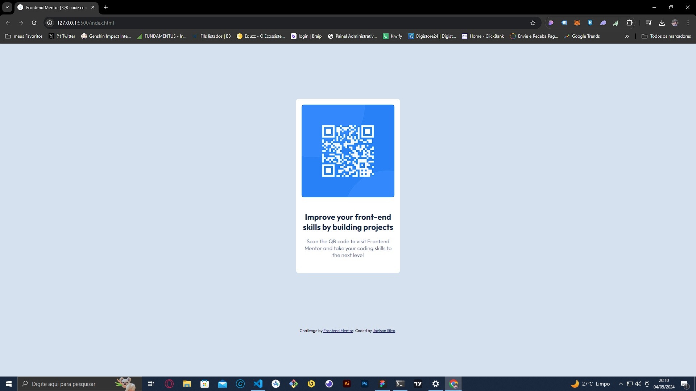

# Frontend Mentor - QR code component solution

Esta é uma solução para o[QR code component challenge on Frontend Mentor](https://www.frontendmentor.io/challenges/qr-code-component-iux_sIO_H). Frontend Mentor challenges ajudá-lo a melhorar suas habilidades de codificação criando projetos realistas.

## Overview

### Screenshot



### Links

- Solution URL: [Add solution URL here](https://your-solution-url.com)
- Live Site URL: [Add live site URL here](https://your-live-site-url.com)

## My process

### Built with

- Semantic HTML5 markup
- CSS custom properties
- Flexbox
- CSS Grid
- Mobile-first workflow

### What I learned

Desafio bem básico só usando um pouco de HTML e CSS, foi só uma prática rápida

```html

<div class="text">
  <p class="title">Improve your front-end skills by building projects</p>
  <p class="description">
    Scan the QR code to visit Frontend Mentor and take your coding skills to the
    next level
  </p>
</div>
```

```css
.proud-of-this-css {
  .QR-card {
    background-color: #ffffff;
    display: grid;
    justify-content: center;
    align-items: center;
    border-radius: 8px;
  }

  .QR-card img {
    width: 288px;
    padding: 16px;
    margin: 0 auto;
    border-radius: 8%;
  }
}
```

### Continued development

Especilizando-se em Reactjs e Web3

## Author

- Website - [Joelson Silva](https://joelson-portfollio.vercel.app/)
- Frontend Mentor - [@JoeSeraphy](https://www.frontendmentor.io/profile/JoeSeraphy)
